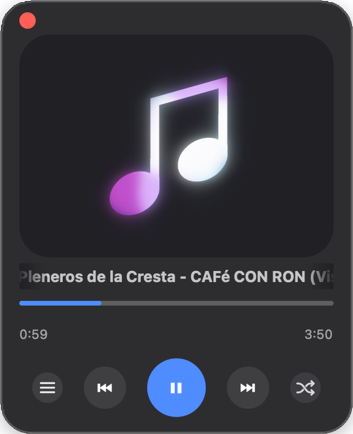
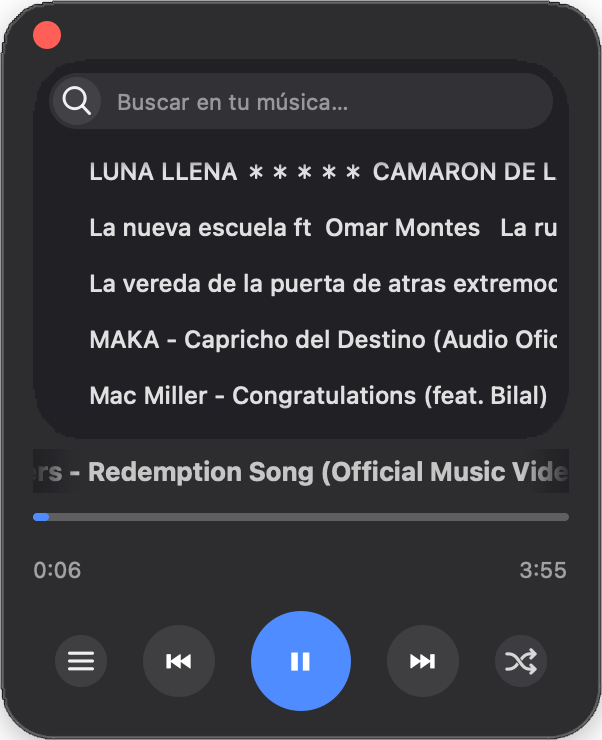
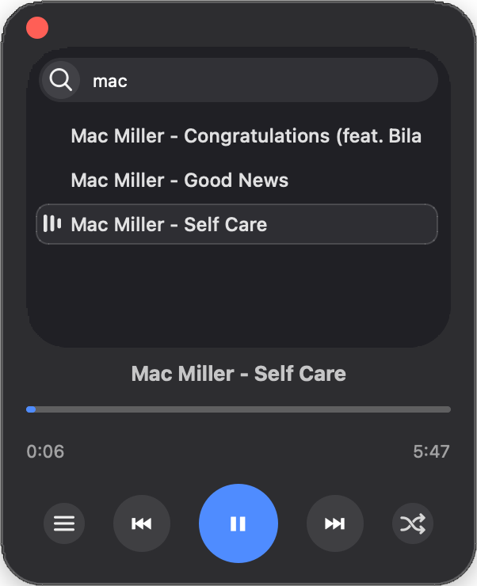
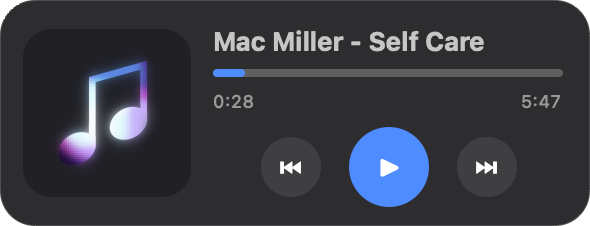

# Digilogic Player

[](https://github.com/danielgpf/Digilogic-Player/releases)
[](https://github.com/danielgpf/Digilogic-Player/releases/latest)
[](LICENSE)
[](https://ko-fi.com/daniel_digilogic)

A minimal music player for macOS and Windows, written in Python with PyQt6.
Frameless window, properly rounded corners, and a panel that works like the
screen of a physical player: a menu you navigate, with your songs, your
playlists, radio and your listening stats behind it.

It plays music straight from whichever folder you point it at — a USB drive
works too — without copying or importing anything anywhere.

<p align="center">
  
  
  
</p>

<p align="center">
  
  <br>
  <sub>Click the note and the window shrinks to this, in a corner of the screen.</sub>
</p>

**Website:** https://digilogic-app.github.io/

## Download

| System | Download |
|---|---|
| macOS (Apple Silicon, macOS 13 or later) | [Digilogic.dmg](https://github.com/danielgpf/Digilogic-Player/releases/latest/download/Digilogic.dmg) |
| Windows 10 or 11 (64-bit) | [Digilogic.exe](https://github.com/danielgpf/Digilogic-Player/releases/latest/download/Digilogic.exe) |

The app isn't code-signed — an Apple signature costs €99 a year and a
Microsoft one is around €200 — so both systems warn you the first time. On
macOS: right-click → Open. On Windows: *More info* → *Run anyway*. Only
needed once. There's more detail in the
[release notes](https://github.com/danielgpf/Digilogic-Player/releases/latest).

## The screen

The panel at the top is the heart of the app. Click the list button and you
land on a menu that slides in and out, the way a physical player would.

- **Songs** — everything in your folder, with a search box that filters as
  you type.
- **Playlists** — the subfolders of your music folder show up as playlists
  on their own. You can also make playlists that live only inside the app,
  so you don't have to reorganise anything on disk. Each one is a card with
  the artwork of its first four tracks.
- **Radio** — stations from your own country, picked up from your system
  settings. The dial number is drawn by hand, with the same animation that
  lives inside the musical note.
- **Statistics** — time listened, tracks played, most played track, time on
  radio and more, counted since the first time you ever opened Digilogic.
  Always there, not once a year. It never leaves your computer.
- **Settings** — six accent colours to choose from, and an *always on top*
  switch that keeps the window above everything else while you work.

## What it does

### Your music

- **Reads your music folder** and shows the album art embedded in each file,
  at full size with a gradient behind it. When a track has none, it draws a
  musical note with coloured lobes that rotate and blend into each other in
  additive mixing.
- **The note beats with the actual music**, following the volume of whatever
  is playing at that moment — not a loop that just happens to move.
- **Plays most audio formats**: `mp3`, `m4a`, `aac`, `flac`, `wav`, `aiff`,
  `ogg`, `opus` and `wma`, reading the tags and the artwork from all of them.
- **Keeps the list up to date on its own.** Copy a track into your folder
  with the app open and it shows up; delete one and it goes. Whatever is
  playing keeps playing.
- **Drag a folder onto the window** to open it. Dropping a single track opens
  its folder and starts playing it.

### Playing

- **Mini mode**: click the note and the window shrinks to a horizontal card
  in the corner of the screen, so you can leave it playing while you work.
  Click again to bring it back.
- **Resumes where you left off**: the track and the exact second are saved
  when you close it, and restored — paused — when you open it again.
- **Media keys work while the window is in the background**, and on macOS
  the track shows up in Control Centre, on the lock screen and on AirPods.
- **Shuffle with real history**: pressing "previous" goes back to the track
  that actually played, not to another random one.
- **"Previous" with a threshold**: if the track has been playing for more
  than 10 seconds it rewinds to the start instead of skipping back, the way
  Spotify and Apple Music do it.

### Out of the way

- **No close button.** Nothing sits on top of the card: you quit from the
  power button in the menu, or with your system's usual shortcut.
- **Follows your system language**, in 14 of them. No language menu: it asks
  the system on startup and picks.
- **Fits into each system**: icons are drawn at the real resolution of Retina
  displays on macOS, and there's a proper taskbar icon on Windows.
- **Works offline.** Nothing is uploaded, nothing is tracked, there are no
  accounts. Radio is the one part that needs a connection, for obvious
  reasons, and it tells you when there isn't one.

## Keyboard

| Key | Action |
|---|---|
| <kbd>Space</kbd> | Play / pause |
| <kbd>←</kbd> | Previous track (or restart the current one) |
| <kbd>→</kbd> | Next track |
| <kbd>⌘Q</kbd> / <kbd>Alt</kbd>+<kbd>F4</kbd> | Quit |
| Media keys | Play, pause, previous, next — even from the background |

## Bugs, ideas and comments

- Something not working? [Report a bug](https://github.com/danielgpf/Digilogic-Player/issues/new?template=fallo.yml).
- Something missing? [Suggest an idea](https://github.com/danielgpf/Digilogic-Player/issues/new?template=idea.yml).
- For questions, opinions, or just to say how you use it: [Discussions](https://github.com/danielgpf/Digilogic-Player/discussions).

Every idea gets read. Digilogic wants to stay small and simple, so not
everything will make it in — but whatever does is credited in the release
notes to whoever suggested it.

## Supporting the project

Digilogic is free and open source, and it will stay that way. If you find
it useful, you can [buy me a coffee on Ko-fi](https://ko-fi.com/daniel_digilogic).
What comes in goes to these goals, in order:

| Goal | Cost | What it unlocks |
|---|---|---|
| Microsoft Store | $19 (one-off) | Installing on Windows without the SmartScreen warning |
| Windows code signing | ~$10/month | The `.exe` downloaded from the site opening with no warnings |
| Apple Developer | $99/year | The Mac app opening with no warnings and, later on, an iPhone version |
| Google Play | $25 (one-off) | An Android version |

## Running from source

You need Python 3.

```bash
git clone https://github.com/danielgpf/Digilogic-Player.git
cd Digilogic-Player
python3 -m venv venv
./venv/bin/pip install -r requirements.txt
./venv/bin/python Digilogic.py
```

On Windows, replace `./venv/bin/` with `venv\Scripts\`.

The first time, click the title ("Choose a folder") to point it at your
music.

### Packaging

- **macOS**: `./venv/bin/python setup.py py2app` → `dist/Digilogic.app`
- **Windows**: `venv\Scripts\python construir_windows.py` → `dist\Digilogic.exe`

Each system can only package for itself: the `.app` is built on a Mac and
the `.exe` on Windows.

## How to use it

| Action | How |
|---|---|
| Choose your music folder | Click the title, or drop a folder on the window |
| Open the menu | The three-line button, then the arrow at the top left |
| Play a track | Double-click it in the list |
| See the artwork of what's playing | Double-click the track that's already playing |
| Search your music | Type in the bar at the top |
| Add a track to a playlist | The **+** to the left of its name in the list |
| Enter or leave mini mode | Click the note or the album art |
| Move the window | Drag it from anywhere |
| Quit | The power button in the menu, or <kbd>⌘Q</kbd> / <kbd>Alt</kbd>+<kbd>F4</kbd> |

## Layout

- `Digilogic.py` — entry point.
- `reproductor.py` — the whole player: interface, animations and logic.
- `setup.py` — macOS packaging (py2app).
- `construir_windows.py` — Windows packaging (PyInstaller).
- `Nota-musica.svg`, `icono aleatorio.png`, `icono lista.png`,
  `Digilogic.ico` — graphics the app loads at runtime.

The code and its comments are written in Spanish, which is the author's
language. The interface and this README are in English.

## Licence

MIT. See [LICENSE](LICENSE).
